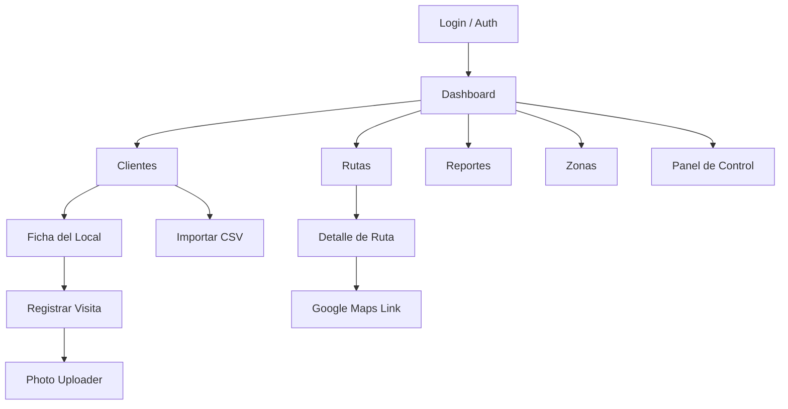

# Arquitectura — Trade Route Tracker

## Visión general

Trade Route Tracker sigue una arquitectura **híbrida Server/Client** propia de Next.js App Router, combinando **Server Components** para data fetching y **Client Components** para interactividad.

```
┌─────────────────────────────────────────────────────────┐
│                    Navegador / Celular                    │
├─────────────────────────────────────────────────────────┤
│  proxy.ts (auth guard)                                   │
│  ┌─────────────────────────────────────────────────┐    │
│  │              App Router (Next.js 16)              │    │
│  │  ┌──────────┐  ┌──────────┐  ┌───────────────┐  │    │
│  │  │ (auth)   │  │(dashboard)│  │   api/auth    │  │    │
│  │  │ /login   │  │ /clientes │  │   /logout     │  │    │
│  │  │ /callback│  │ /rutas    │  │               │  │    │
│  │  └──────────┘  │ /dashboard│  └───────────────┘  │    │
│  │                 │ /importar │                      │    │
│  │                 │ /reportes │                      │    │
│  │                 │ /panel    │                      │    │
│  │                 └──────────┘                      │    │
│  └─────────────────────────────────────────────────┘    │
│                          │                               │
│              ┌───────────┴───────────┐                   │
│              │   Server Actions      │                   │
│              │   (lib/actions/)      │                   │
│              └───────────┬───────────┘                   │
│                          │                               │
│              ┌───────────┴───────────┐                   │
│              │   Supabase Client     │                   │
│              │   (server.ts)         │                   │
│              └───────────┬───────────┘                   │
└──────────────────────────┼────────────────────────────────┘
                           │
              ┌────────────┴────────────┐
              │       Supabase          │
              │  ┌──────┐ ┌──────────┐  │
              │  │ Auth │ │PostgreSQL│  │
              │  └──────┘ │  + RLS   │  │
              │           │  + RPC   │  │
              │           └──────────┘  │
              │  ┌──────────────────┐   │
              │  │ Storage (fotos)  │   │
              │  └──────────────────┘   │
              └─────────────────────────┘
```

## Patrones

### Server Components + Server Actions

- **Server Components**: Páginas (`page.tsx`) y layouts que hacen fetch de datos directamente en el servidor usando `createClient()` (Supabase server client)
- **Server Actions**: Funciones `"use server"` en `lib/actions/` que reciben `FormData` y ejecutan mutaciones con validación Zod + RLS
- **Client Components**: Formularios interactivos (`visit-form.tsx`, `client-form.tsx`, `photo-uploader.tsx`) marcados con `"use client"`

### Data Access Layer (DAL)

- `lib/dals.ts` implementa `verifySession()` usando `React.cache()` para memoizar dentro de una render pass
- Llamado desde layouts protegidos; redirecciona a `/login` si no hay sesión
- Auto-crea perfil si el trigger SQL falló

### Flujo de autenticación

```
Usuario → /login → click Google/GitHub → Supabase OAuth → /auth/callback
  → exchangeCodeForSession(code) → cookies de sesión → /dashboard
```

### Flujo de datos (ejemplo: crear visita)

```
VisitForm (client) → FormData → createVisit() (server action)
  → Zod validation → supabase.from("visits").insert({...user_id})
  → trigger SQL actualiza clients.status
  → revalidatePath("/clientes/[id]")
  → browser refresh via router.refresh()
```

## Estructura de carpetas

| Directorio | Responsabilidad |
|---|---|
| `src/app/(auth)/` | Login, callback OAuth, layout de auth |
| `src/app/(dashboard)/` | Layout protegido + todas las páginas de negocio |
| `src/app/api/` | Endpoints REST (logout) |
| `src/components/ui/` | Primitivas shadcn/ui (button, input, select...) |
| `src/components/shared/` | Badges, botones, skeletons reutilizables |
| `src/components/clients/` | Tabla, filtros, formulario de cliente |
| `src/components/visits/` | Formulario de visita, photo uploader |
| `src/components/dashboard/` | KPI card, zone progress card |
| `src/components/layout/` | Sidebar desktop, bottom nav mobile |
| `src/lib/actions/` | Server Actions (1 archivo por dominio) |
| `src/lib/supabase/` | Clientes Supabase (browser + server) |
| `src/lib/types/` | Tipos TypeScript |
| `src/lib/validations/` | Schemas Zod |
| `src/lib/utils/` | CSV parser, helpers |
| `src/lib/constants.ts` | Constantes compartidas |
| `src/lib/dals.ts` | Data Access Layer (verifySession) |
| `src/lib/url.ts` | Resolvedor de URL (dev/prod) |
| `src/proxy.ts` | Middleware de auth (Next.js 16: reemplaza middleware) |
| `supabase/migrations/` | Migración SQL idempotente |

## Diagrama de módulos



## Decisiones técnicas

1. **`proxy.ts` en vez de `middleware.ts`**: Next.js 16 deprecó `middleware` y lo renombró a `proxy`. Se usa solo para verificación optimista de cookies.
2. **Server Actions en vez de API Routes**: Las mutaciones usan Server Actions con `FormData`, lo que evita exponer endpoints REST adicionales y simplifica el manejo de sesión.
3. **Un solo archivo de migración**: `001_initial_schema.sql` es idempotente (todo usa `IF NOT EXISTS` o `OR REPLACE`), se ejecuta directamente en Supabase SQL Editor.
4. **`lib/constants.ts`** como fuente única de verdad para labels, colores y opciones de formulario. Evita duplicación.
5. **Zod validación en Server Actions** (no en cliente): Los formularios envían datos crudos y el servidor valida. El cliente muestra errores vía toast.
