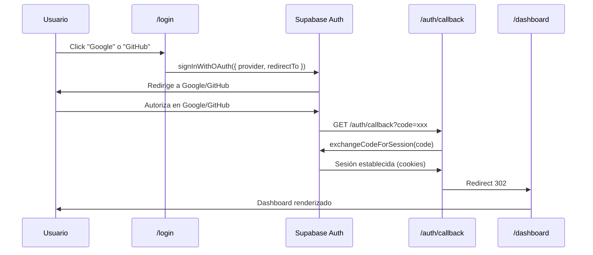

# Autenticación — Trade Route Tracker

## Tipo de autenticación

**Supabase Auth** con dos métodos:

1. **Google OAuth** (proveedor principal)
2. **Magic Link** (email OTP, como alternativa)

No se usa contraseña. No hay registro tradicional.

## Flujo de autenticación



### Magic Link (alternativo)

```
Usuario → email → signInWithOtp({ email, emailRedirectTo }) 
  → revisa correo → click link → /auth/callback?code=xxx 
  → exchangeCodeForSession → /dashboard
```

## Capas de protección

### 1. `proxy.ts` (capa optimista)

Reemplazo de middleware en Next.js 16. Solo verifica cookies de sesión:

```typescript
const PUBLIC_PATHS = ["/login", "/auth/callback", "/_next", "/api/auth"];

if (!user && !isPublicPath) → redirect("/login")
if (user && path === "/login") → redirect("/dashboard")
```

**No hace consultas a BD** — es solo cookie-based, siguiendo las best practices de Next.js.

### 2. `verifySession()` en DAL (capa segura)

```typescript
// lib/dals.ts
export const verifySession = cache(async () => {
  const supabase = await createClient();
  const { data: { user } } = await supabase.auth.getUser();
  if (!user) redirect("/login");
  // ... obtener/crear perfil
  return { user, profile };
});
```

Llamado desde `(dashboard)/layout.tsx`. Usa `React.cache()` para memoizar. Hace la verificación real contra Supabase.

### 3. Row Level Security (capa de base de datos)

Ver [database.md](database.md) para el detalle completo. Resumen:

- **SELECT**: `true` (cualquier sesión autenticada puede leer)
- **INSERT/UPDATE/DELETE**: Verifica `auth.uid()` para ownership (visits, routes) o `auth.uid() IS NOT NULL` (zones, clients)

## Sesiones

- **Cookies**: Supabase almacena `sb-{project-ref}-auth-token` y `sb-{project-ref}-auth-token-code-verifier`
- **Duración**: Configurada en Supabase Dashboard (default: 1 hora access token, 7 días refresh token)
- **Refresh**: `@supabase/ssr` maneja el refresh automático vía cookies

## Roles

| Rol | Descripción | Uso actual |
|---|---|---|
| `admin` | Acceso total | No implementado aún |
| `supervisor` | Vista de supervisión | No implementado aún |
| `ejecutivo` | Acceso estándar | No implementado aún |
| `practicante` | Usuario por defecto | Todos los usuarios nuevos |

El campo `role` existe en `profiles` y el trigger lo asigna como `'practicante'`. La UI no tiene diferenciación por rol en esta versión (MVP).

## Logout

`POST /api/auth/logout` → `supabase.auth.signOut()` → redirect `/login`

## Configuración en Supabase

### Authentication → URL Configuration

| Campo | Valor dev | Valor prod |
|---|---|---|
| Site URL | `http://localhost:3000` | `https://trade-route-tracker.vercel.app` |
| Redirect URLs | `http://localhost:3000/auth/callback` | `https://trade-route-tracker.vercel.app/auth/callback` |

### Authentication → Providers

- Google: habilitado con Client ID/Secret
- GitHub: habilitado con Client ID/Secret (opcional)

## Variables de entorno

```
NEXT_PUBLIC_SUPABASE_URL=https://xxx.supabase.co
NEXT_PUBLIC_SUPABASE_ANON_KEY=eyJhbG...
NEXT_PUBLIC_SITE_URL=https://trade-route-tracker.vercel.app
```
