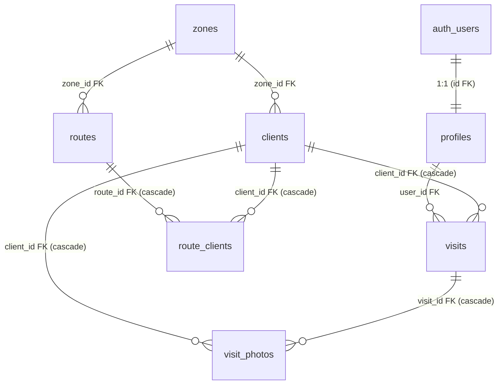

# Base de Datos — Trade Route Tracker

## Motor

PostgreSQL 15 (gestionado por Supabase)

## Diagrama Entidad-Relación

## Tablas

### profiles
Extiende `auth.users`. Auto-creado por trigger `handle_new_user()`.

| Columna | Tipo | Notas |
|---|---|---|
| `id` | uuid PK | FK → auth.users(id), cascade delete |
| `full_name` | text | nullable |
| `email` | text | nullable |
| `role` | text | CHECK: admin/supervisor/ejecutivo/practicante, default 'practicante' |
| `created_at` | timestamptz | default now() |

### zones
11 zonas seed (6 RM + 5 V Región).

| Columna | Tipo | Notas |
|---|---|---|
| `id` | uuid PK | gen_random_uuid() |
| `name` | text | NOT NULL |
| `region` | text | NOT NULL (RM, V) |
| `description` | text | nullable |
| `created_at` | timestamptz | default now() |

### clients
Locales / puntos de venta.

| Columna | Tipo | Notas |
|---|---|---|
| `id` | uuid PK | gen_random_uuid() |
| `name` | text | NOT NULL |
| `address` | text | nullable |
| `region` | text | nullable |
| `comuna` | text | nullable |
| `zone_id` | uuid FK | → zones(id), SET NULL on delete |
| `executive` | text | nullable |
| `visit_day` | text | nullable |
| `dispatch_day` | text | nullable |
| `priority` | text | CHECK: alta/media/baja, default 'media' |
| `status` | text | CHECK: 6 estados, default 'pendiente' |
| `google_maps_url` | text | nullable |
| `general_notes` | text | nullable |
| `created_at` | timestamptz | default now() |
| `updated_at` | timestamptz | default now(), auto-updated by trigger |

### visits
Registro de visitas en terreno.

| Columna | Tipo | Notas |
|---|---|---|
| `id` | uuid PK | gen_random_uuid() |
| `client_id` | uuid FK | → clients(id), CASCADE delete |
| `user_id` | uuid FK | → profiles(id), SET NULL on delete |
| `visit_date` | date | NOT NULL |
| `visit_time` | time | nullable |
| `contact_name` | text | nullable |
| `contact_role` | text | nullable |
| `could_talk` | boolean | nullable |
| `no_contact_reason` | text | nullable |
| `total_taps` | integer | nullable |
| `kross_taps` | integer | nullable |
| `best_selling_brand` | text | nullable |
| `kross_price` | integer | nullable |
| `competitor_price` | integer | nullable |
| `kross_on_menu` | text | nullable |
| `menu_execution` | text | nullable |
| `pop_material` | text[] | nullable (array) |
| `competitors` | text[] | nullable (array) |
| `most_visible_competitor` | text | nullable |
| `recommended_brand_by_staff` | text | nullable |
| `competitor_notes` | text | nullable |
| `opportunity_type` | text[] | nullable (array) |
| `next_action` | text | nullable |
| `follow_up_date` | date | nullable |
| `follow_up_priority` | text | CHECK: alta/media/baja |
| `general_notes` | text | nullable |
| `final_status` | text | CHECK: 5 estados |
| `created_at` | timestamptz | default now() |

### visit_photos
Fotos de visitas almacenadas en Supabase Storage.

| Columna | Tipo | Notas |
|---|---|---|
| `id` | uuid PK | gen_random_uuid() |
| `visit_id` | uuid FK | → visits(id), CASCADE delete |
| `client_id` | uuid FK | → clients(id), CASCADE delete |
| `photo_url` | text | NOT NULL (URL pública de Supabase Storage) |
| `photo_type` | text | CHECK: fachada/barra/carta/material_pop/competencia/salidas_cerveza/otro |
| `created_at` | timestamptz | default now() |

### routes
Rutas planificadas.

| Columna | Tipo | Notas |
|---|---|---|
| `id` | uuid PK | gen_random_uuid() |
| `user_id` | uuid FK | → profiles(id), SET NULL on delete |
| `name` | text | NOT NULL |
| `region` | text | nullable |
| `zone_id` | uuid FK | → zones(id), SET NULL on delete |
| `route_date` | date | nullable |
| `status` | text | CHECK: planificada/en_progreso/completada/cancelada, default 'planificada' |
| `created_at` | timestamptz | default now() |

### route_clients
Join table: locales en una ruta.

| Columna | Tipo | Notas |
|---|---|---|
| `id` | uuid PK | gen_random_uuid() |
| `route_id` | uuid FK | → routes(id), CASCADE delete |
| `client_id` | uuid FK | → clients(id), CASCADE delete |
| `position` | integer | nullable (orden en la ruta) |
| `created_at` | timestamptz | default now() |

## Índices

| Índice | Tabla | Columna(s) |
|---|---|---|
| `idx_clients_zone_id` | clients | zone_id |
| `idx_clients_status` | clients | status |
| `idx_clients_region` | clients | region |
| `idx_visits_client_id` | visits | client_id |
| `idx_visits_user_id` | visits | user_id |
| `idx_visits_visit_date` | visits | visit_date |
| `idx_visit_photos_visit_id` | visit_photos | visit_id |
| `idx_routes_user_id` | routes | user_id |
| `idx_route_clients_route_id` | route_clients | route_id |

## Triggers

| Trigger | Tabla | Evento | Función |
|---|---|---|---|
| `on_auth_user_created` | auth.users | AFTER INSERT | Crea registro en `profiles` |
| `update_clients_updated_at` | clients | BEFORE UPDATE | Actualiza `updated_at` a now() |
| `update_client_status_after_visit` | visits | AFTER INSERT OR UPDATE OF final_status | Sincroniza `clients.status` = `visits.final_status` |

## Row Level Security

Todas las tablas tienen RLS habilitado.

| Tabla | SELECT | INSERT | UPDATE | DELETE |
|---|---|---|---|---|
| profiles | `true` | `auth.uid() = id` | `auth.uid() = id` | — |
| zones | `true` | `auth.uid() IS NOT NULL` | `auth.uid() IS NOT NULL` | `auth.uid() IS NOT NULL` |
| clients | `true` | `auth.uid() IS NOT NULL` | `auth.uid() IS NOT NULL` | `auth.uid() IS NOT NULL` |
| visits | `true` | `auth.uid() = user_id` | `auth.uid() = user_id` | `auth.uid() = user_id` |
| visit_photos | `true` | auth + exists visit ownership | — | exists visit ownership |
| routes | `true` | `auth.uid() = user_id` | `auth.uid() = user_id` | `auth.uid() = user_id` |
| route_clients | `true` | exists route ownership | — | exists route ownership |

## Migración

Archivo único: `supabase/migrations/001_initial_schema.sql` (309 líneas, idempotente).

Ejecutar en Supabase SQL Editor. El archivo usa:
- `CREATE TABLE IF NOT EXISTS`
- `CREATE INDEX IF NOT EXISTS`
- `CREATE OR REPLACE FUNCTION/TRIGGER`
- `DROP POLICY IF EXISTS` antes de cada `CREATE POLICY`
- `GRANT ALL` al final para asegurar permisos

## Storage

Bucket: `visit-photos` (público)

| Política | Operación | Condición |
|---|---|---|
| Public view | SELECT | `bucket_id = 'visit-photos'` |
| Auth upload | INSERT | `bucket_id = 'visit-photos' AND auth.role() = 'authenticated'` |
| Owner delete | DELETE | `bucket_id = 'visit-photos' AND auth.uid() = owner` |
