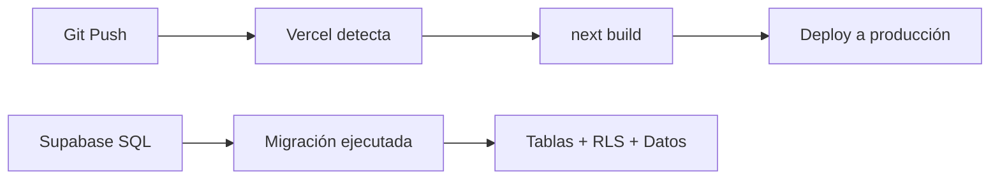

# Despliegue — Trade Route Tracker

## Plataforma recomendada

**Vercel** (nativo para Next.js) + **Supabase** (backend as a service).

## Variables de entorno en Vercel

Configurar en Vercel Dashboard → Settings → Environment Variables:

| Variable | Descripción |
|---|---|
| `NEXT_PUBLIC_SUPABASE_URL` | URL del proyecto Supabase |
| `NEXT_PUBLIC_SUPABASE_ANON_KEY` | Anon/public key de Supabase |
| `NEXT_PUBLIC_SITE_URL` | `https://trade-route-tracker.vercel.app` |

## Build

```bash
npm run build -- --webpack  # Windows sin Turbopack
npm run build               # Linux/Mac con Turbopack
```

Vercel detecta automáticamente el framework Next.js y ejecuta `next build`.

## Migración de base de datos

1. Ir a Supabase Dashboard → SQL Editor
2. Copiar y pegar `supabase/migrations/001_initial_schema.sql`
3. Ejecutar (el archivo es idempotente: se puede ejecutar múltiples veces sin error)

## Storage

1. Supabase Dashboard → Storage
2. Crear bucket `visit-photos` (marcar como público)
3. Las políticas de storage están incluidas en la migración SQL

## Supabase Auth

### Redirect URLs

Agregar en Supabase → Authentication → URL Configuration:

```
http://localhost:3000/auth/callback
https://trade-route-tracker.vercel.app/auth/callback
```

### Providers

Habilitar Google OAuth (y GitHub opcional) en Authentication → Providers con los Client ID/Secret correspondientes.

## Flujo de deploy



## Dominios y URLs

| Entorno | URL |
|---|---|
| Producción | `https://trade-route-tracker.vercel.app` |
| Supabase | `https://cvayjrtvctybbhvfquvh.supabase.co` |
| Dev local | `http://localhost:3000` |

## CI/CD

No configurado explícitamente. Vercel ofrece deploy automático en cada push a la rama principal.

### Recomendación para CI/CD

```yaml
# .github/workflows/ci.yml (sugerido)
name: CI
on: [push, pull_request]
jobs:
  build:
    runs-on: ubuntu-latest
    steps:
      - uses: actions/checkout@v4
      - uses: actions/setup-node@v4
      - run: npm ci
      - run: npx tsc --noEmit
      - run: npm run build
```

## Docker

No implementado. La app está diseñada para deploy serverless en Vercel. Para Docker:

```dockerfile
FROM node:22-alpine
WORKDIR /app
COPY package*.json ./
RUN npm ci --production
COPY . .
RUN npm run build
EXPOSE 3000
CMD ["npm", "start"]
```

## Consideraciones de escalabilidad

- **Vercel**: escala automáticamente con serverless functions
- **Supabase**: plan gratuito incluye 500 MB de BD y 2 GB de storage. Para más de 300 clientes y fotos, considerar plan Pro
- **Imágenes**: sin compresión client-side en esta versión. Con muchas fotos, considerar resize antes del upload
